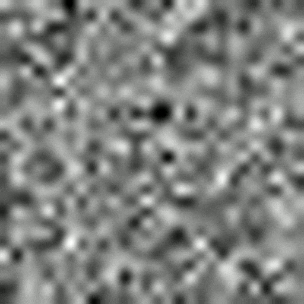
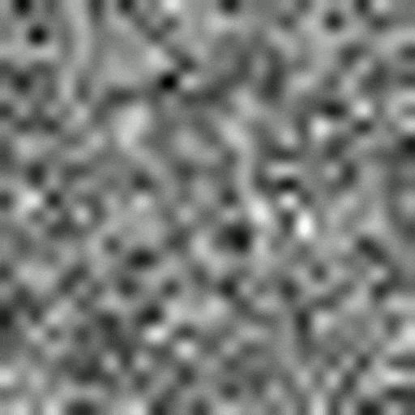
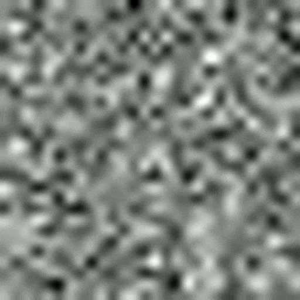
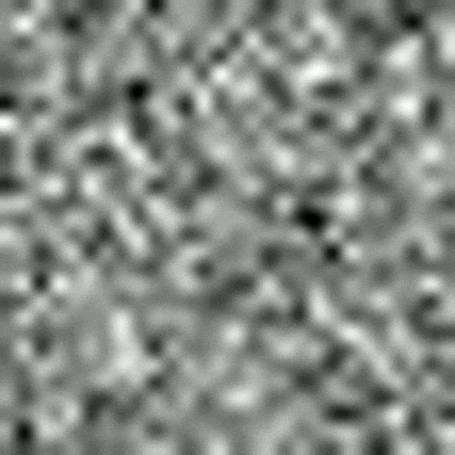
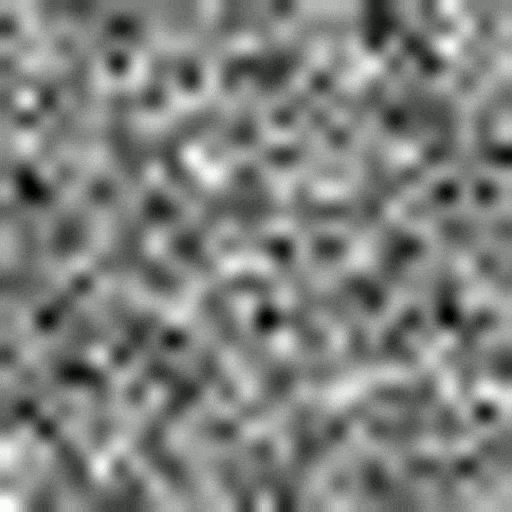
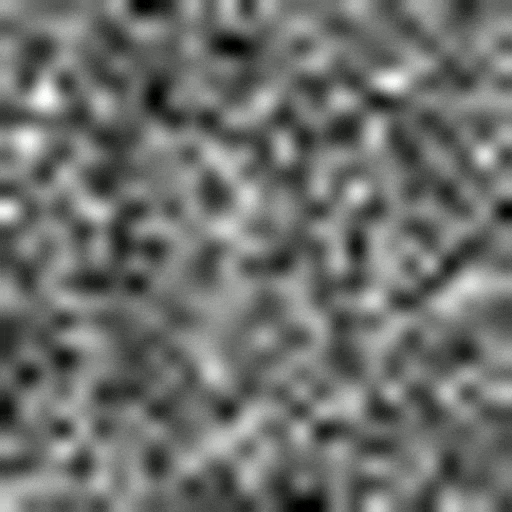
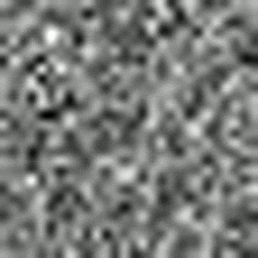
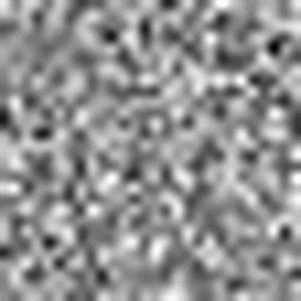
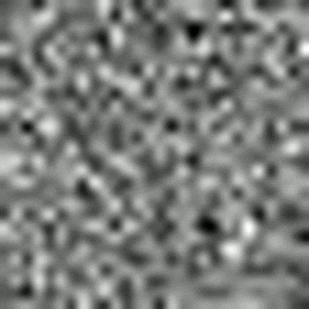

# Diffusion Model on MNIST Dataset

Vanilla Unet Diffusion Model trained on the MNIST dataset.

Key techniques:
1. Cosine scheduler
2. Noise perturbation for image generation
3. Label and Time-step conditioning

| Num Epochs | Batch-size | Learning rate | Final loss |
| - | - | - | - |
| 100 | 256 | 10e-4 | 0.03 |

## Demo

0 | 1 | 2 | 3 | 4
:-:|:-:|:-:|:-:|:-:
 |  |  |  | 
5 | 6 | 7 | 8 | 9
 |  |  |  | 

## Setup

Tested on Ubuntu 22.04:

```bash
conda env create -n mnistdiffuse -f environment.yml
conda activate mnistdiffuse
```

## Usage

Train:

```bash
python3 train.py
```

Generate:
```bash
python3 generate.py
```

## Issues


## Contribution

1. Hamid Mohammadi: <hamid4@ualberta.ca>
